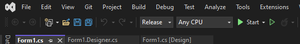

# Med2ModLauncher

Med2ModLauncher is created after a Steam update that made more complicated for an average user to run mods.
The update made necessary to use some workarounds like renaming the mod folder by vanilla game mod paths or having
to manually craft a shortcut or .bat file that runs medieval 2 with the appropriate command line arguments.

I decided to open the project so it may be updated for anybody at any time and for any reason 🙂.

Keep in mind the project is meant to be kept as simple as possible and vendor neutral.

## How to build it

1. Download a Visual Studio Community version. Solution has been tested under VS 2022.
2. Open the `Med2ModLauncher.sln` file.
3. For development testing, just use the Start button. Remember to install first Medieval II from any distribution mean so the mod folders are available to test the launcher.
4. For distribution, build it in Release mode and find the built executable file under the `Med2ModLauncher/bin/Release/Med2ModLauncher.exe`.
    


## Abstract

Med2ModLauncher is a simple Windows Forms application. It uses callback events as the communication mean between the form and the user code.

On startup, it automatically looks for the common locations where Medieval II Total War is normally installed when installed with Steam and loads all the available mods.
If Medieval II is installed in a custom location, then the menu may be used in order to change the directory where Medieval II is installed.


Remember to select the root folder of your Medieval II installation location.

This location will be stored in the registry key `HKEY_CURRENT_USER\SOFTWARE\Med2ModLauncher` to avoid asking it every time to the user.

### How Med2ModLauncher launches the game

If a mod icon is double-click and also if the Launch button is clicked, Med2ModLauncher runs the game. This is done calling the event listener `OnLaunch`.

`OnLaunch` runs the `medieval2.exe` with extra command arguments necessary in order to run the selected mod.

The command run is equivalent to:

```
> medieval2.exe --features.mod=mods/<mod-folder> --io.file_first
```

## License

Commercial-use is forbidden. This software is licensed under CC-BY-NC-4.0.

<p align="center">
Steam is a trademark of Valve Corporation.
</p>
<p align="center">
Medieval Total War is a trademark of Creative Assembly.
</pre>